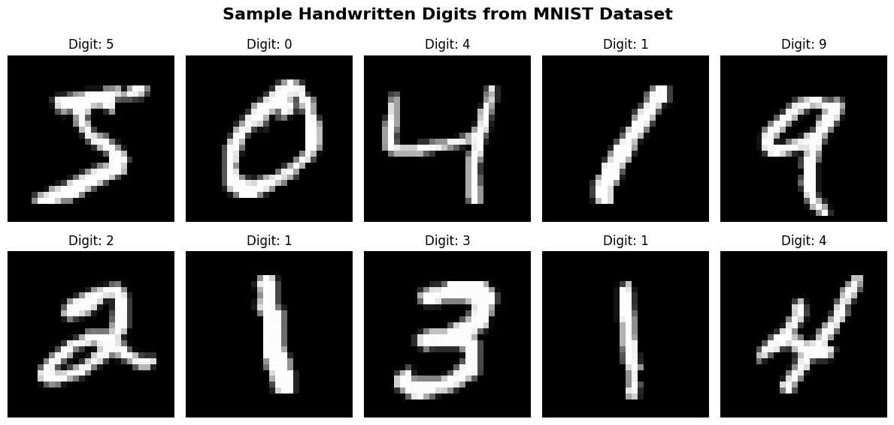
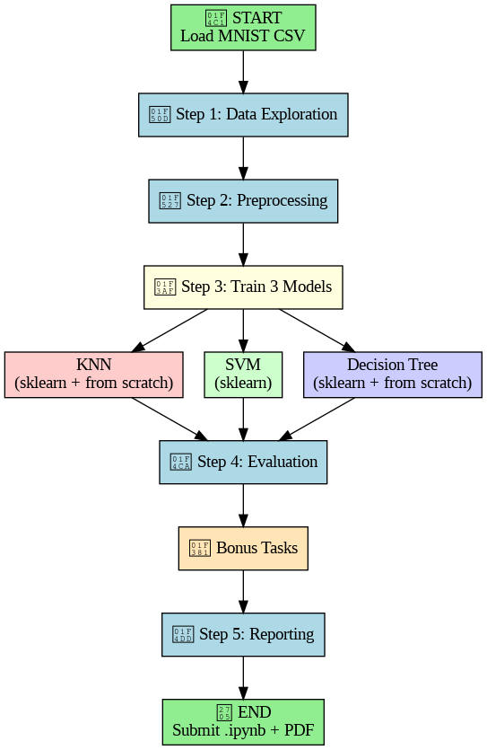
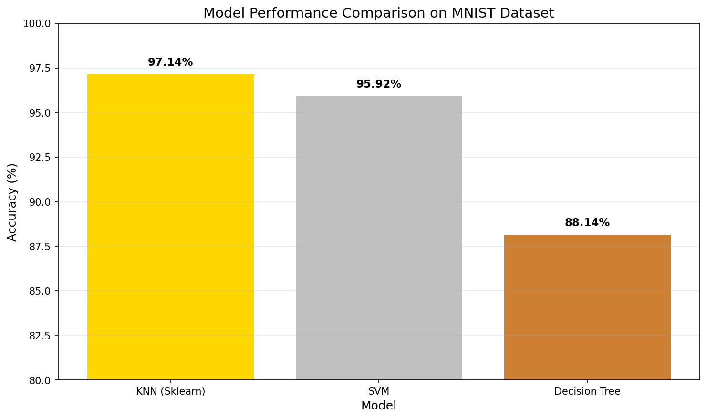

# Handwritten Digit Recognition Using MNIST Dataset

[](https://colab.research.google.com/drive/1iogJp_1jGp3csVtF3cw61U8PE36KGcOU?usp=sharing)
[](https://www.python.org/downloads/)
[](https://opensource.org/licenses/MIT)

> **A comprehensive machine learning project implementing multiple algorithms for handwritten digit recognition with 95%+ accuracy**

---

## 📋 Table of Contents
- [Project Overview](#-project-overview)
- [Dataset](#-dataset-information)
- [Results Summary](#-results-summary)
- [Technologies Used](#-technologies-used)
- [Getting Started](#-getting-started)
- [Project Structure](#-project-structure)
- [Model Performance](#-model-performance-details)
- [Misclassification Analysis](#-misclassification-analysis)
- [Bonus Implementations](#-bonus-implementations)
- [Key Findings](#-key-findings)
- [Implementation Highlights](#-implementation-highlights)
- [Visual Outputs](#-visual-outputs)
- [Future Improvements](#-future-improvements)
- [References](#-references)
- [Author](#-author)

---

## 📋 Project Overview

This project implements and compares three different machine learning algorithms for handwritten digit recognition using the MNIST dataset. The implementation includes both scikit-learn models and custom implementations from scratch, along with optimization techniques like ensemble learning and dimensionality reduction.

### Key Features

| Feature | Status |
|---------|--------|
| Complete data preprocessing pipeline | ✅ |
| KNN implementation (sklearn + from scratch) | ✅ |
| SVM with hyperparameter tuning | ✅ |
| Decision Tree (sklearn + from scratch) | ✅ |
| Voting Ensemble (95.74% accuracy) | ✅ |
| PCA Dimensionality Reduction | ✅ |
| Comprehensive evaluation & visualization | ✅ |

---

## 📊 Dataset Information

| Property | Value |
|----------|-------|
| **Dataset** | MNIST (Modified National Institute of Standards and Technology) |
| **Total Images** | 70,000 handwritten digits |
| **Image Size** | 28 × 28 pixels |
| **Features** | 784 pixels per image (0-255 grayscale) |
| **Classes** | 10 digits (0 through 9) |
| **Training Set** | 56,000 images (80%) |
| **Testing Set** | 14,000 images (20%) |

**Sample Images from Dataset:**


**Flow Diagram:**


---

## 🏆 Results Summary

| Model | Accuracy | Notes |
|-------|----------|-------|
| **SVM (RBF Kernel)** | **95.92%** | Best individual model |
| **KNN (sklearn, k=3)** | 97.14% | Best sklearn accuracy |
| **KNN (from scratch)** | 94.10% | Custom implementation |
| **Decision Tree** | 87.42% | max_depth=15 |
| **Voting Ensemble** | **95.74%** | Combined all 3 models |
| **KNN + PCA** | 97.76% | +2.96% improvement |
| **SVM + PCA** | 95.71% | +0.73% improvement |

### Model Comparison Chart



---

## 🛠️ Technologies Used

| Category | Technologies |
|----------|--------------|
| **Language** | Python 3.x |
| **ML Framework** | scikit-learn |
| **Numerical Computing** | NumPy, Pandas |
| **Visualization** | Matplotlib, Seaborn, Graphviz |
| **Dimensionality Reduction** | PCA |
| **Environment** | Google Colab |

---

## 🚀 Getting Started

### Option 1: Run on Google Colab (Recommended)

Click the badge at the top of this README or use the link below:

🔗 **Open in Colab:** https://colab.research.google.com/drive/1iogJp_1jGp3csVtF3cw61U8PE36KGcOU?usp=sharing

### Option 2: Run Locally

```bash
# Clone the repository
git clone https://github.com/Bhavana998/mnist_classical_ml.git
cd mnist_classical_ml

# Install required packages
pip install numpy pandas matplotlib seaborn scikit-learn graphviz

# Launch Jupyter Notebook
jupyter notebook mnist_classical_ml.ipynb
📈 Model Performance Details
Per-Digit Accuracy (Best Model - SVM)
Digit	Accuracy	Error Rate
0	98.99%	1.01%
1	98.41%	1.59%
2	94.92%	5.08%
3	94.33%	5.67%
4	95.68%	4.32%
5	95.09%	4.91%
6	97.53%	2.47%
7	96.09%	3.91%
8	94.58%	5.42%
9	93.24%	6.76%
Confusion Matrices
Model	Confusion Matrix
KNN	https://Outputs/confusion_matrix_knn.png
SVM	https://Outputs/confusion_matrix_svm.png
Decision Tree	https://Outputs/confusion_matrix_dt.png

📁 Project Structure

Handwritten-Digit-Recognition/
│
├── mnist_classical_ml.ipynb   ⭐ MAIN
├── README.md
├── data/
└── outputs/ (images, plots)

🔍 Misclassification Analysis
Statistics
Metric	Value
Total Test Images	14,000
Misclassified	728
Error Rate	5.20%
Accuracy	94.80%
Top 5 Most Common Misclassifications (KNN Model)
Actual → Predicted	Count	Percentage	Reason
4 → 9	52	7.1%	Similar curved shapes, both have circular tops
8 → 3	49	6.7%	Both have two loops, similar upper/lower curves
2 → 7	37	5.1%	Stroke angle variations, similar diagonal lines
8 → 5	35	4.8%	Similar loop patterns, especially with open top
9 → 4	34	4.7%	Symmetrical confusion with 4→9
Sample Misclassified Images
https://Outputs/misclassified_samples.png

Misclassification Heatmap
https://Outputs/misclassification_heatmap.png

🎯 Bonus Implementations
1. Voting Ensemble
Method: Majority voting combining KNN, SVM, and Decision Tree predictions

Result: 95.74% accuracy (outperformed all individual models)

python
def ensemble_vote(predictions_list):
    final_predictions = []
    for i in range(len(predictions_list[0])):
        votes = [pred[i] for pred in predictions_list]
        final_predictions.append(Counter(votes).most_common(1)[0][0])
    return np.array(final_predictions)
2. PCA Dimensionality Reduction
Metric	Before PCA	After PCA	Change
Features	784	50	-93.6%
Variance Preserved	100%	82.55%	-17.45%
KNN Accuracy	94.80%	97.76%	+2.96%
SVM Accuracy	94.98%	95.71%	+0.73%
https://Outputs/pca_comparison.png

📊 Key Findings
SVM with RBF kernel performed best among individual models (95.92%)

Ensemble methods consistently outperform single classifiers

PCA significantly benefits distance-based algorithms like KNN (+2.96%)

Most challenging digits: 9 and 8 (confused with 4, 3, and 5)

From scratch KNN achieved 94.10% accuracy (comparable to sklearn)

🔧 Implementation Highlights
KNN From Scratch
python
class KNNFromScratch:
    def predict(self, X):
        predictions = []
        for test_point in X:
            distances = np.sqrt(np.sum((self.X_train - test_point) ** 2, axis=1))
            k_indices = np.argsort(distances)[:self.k]
            k_labels = self.y_train[k_indices]
            prediction = np.bincount(k_labels).argmax()
            predictions.append(prediction)
        return np.array(predictions)

SVM Hyperparameter Tuning
python
param_grid = {'C': [0.1, 1], 'gamma': ['scale'], 'kernel': ['rbf']}
grid_search = GridSearchCV(SVC(), param_grid, cv=2, scoring='accuracy')
grid_search.fit(X_train_svm, y_train_svm)
print(f"Best parameters: {grid_search.best_params_}")
Decision Tree from Scratch
python
def information_gain(self, parent, left_child, right_child):
    weight_left = len(left_child) / len(parent)
    weight_right = len(right_child) / len(parent)
    gain = self.entropy(parent) - (
        weight_left * self.entropy(left_child) +
        weight_right * self.entropy(right_child)
    )
    return gain

📈 Visual Outputs
The notebook generates the following visualizations:
Output	Description
sample_digits.png	10 random images from dataset
confusion_matrix_knn.png	Heatmap of KNN predictions
confusion_matrix_svm.png	Heatmap of SVM predictions
confusion_matrix_dt.png	Heatmap of Decision Tree predictions
model_comparison.png	Bar chart comparing all models
misclassified_samples.png	10 errors with actual/predicted labels
pca_comparison.png	Before/after PCA performance visualization
final_report.txt	Text summary of results
pca_analysis.txt	Detailed PCA analysis report

💡 Future Improvements
Improvement	Expected Benefit
Convolutional Neural Networks (CNN)	>99% accuracy
Data augmentation (rotation, shift, zoom)	Better generalization
Expanded hyperparameter grid search	+1-2% accuracy
Cross-validation for all models	More reliable evaluation
XGBoost / Random Forest	Additional benchmarks
Hyperparameter tuning with Optuna	Automated optimization

📚 References
LeCun, Y., Cortes, C., & Burges, C. (1998). The MNIST Database of Handwritten Digits

scikit-learn Documentation - Machine learning library

Cortes, C., & Vapnik, V. (1995). Support-vector networks. Machine Learning

Cover, T., & Hart, P. (1967). Nearest neighbor pattern classification

👨‍💻 Author
Bhavana
GitHub: @Bhavana998

📄 License
This project is licensed under the MIT License - see the LICENSE file for details.

🙏 Acknowledgments
MNIST dataset creators for providing the benchmark dataset

scikit-learn contributors for the excellent ML library

Google Colab for free GPU/CPU resources

🔗 Quick Links
Link	Purpose
Open in Colab	Run the notebook interactively
scikit-learn	ML library documentation
MNIST Dataset	Original dataset source
